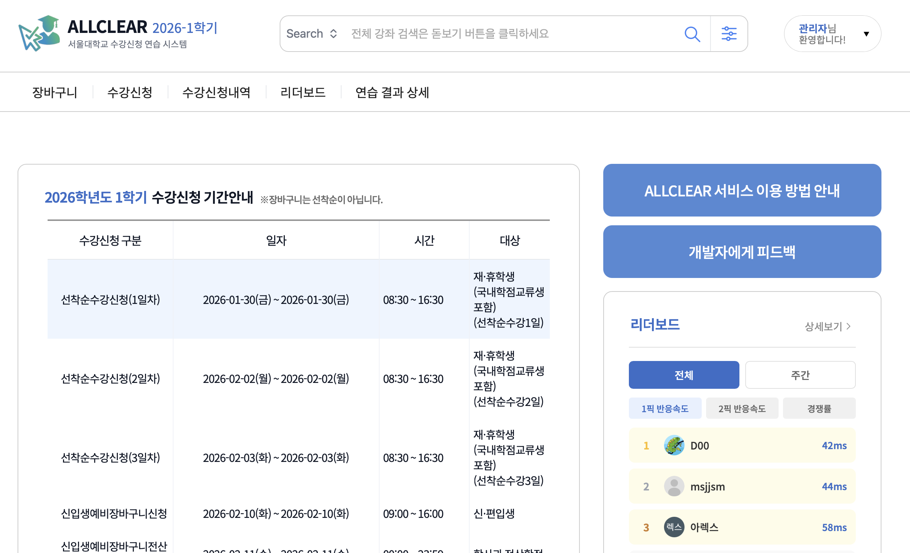

# AllClear Server

**서울대학교 수강신청 연습 서비스 - 백엔드 레포지토리**



- 서비스: https://allclear.codes
- API 문서: https://allclear.codes/swagger-ui/index.html
- 프론트엔드 레포: https://github.com/wafflestudio/23-5-team8-web

## 팀원

### Server

| 이름 | 담당                                                         |
|------|------------------------------------------------------------|
| 강민보 | 인프라/배포, 회원가입/로그인, 마이페이지, 공지사항                              |
| 이슬찬 | 프로젝트 설정(Spring Boot, CI/CD), 강의 임포트/검색, 소셜 로그인, 장바구니, 리더보드 |
| 최연서 | DB 설계(ERD), 수강신청 연습 세션 관리, 수강신청 성공 판정 로직                           |

### Web

서민석, 오세민

## 이용가이드

서비스 이용가이드는 [여기](https://boulder-argon-568.notion.site/AllClear-2f30bdb7bbc18009802eccb739810da2)에서 확인할 수 있습니다.

## 주요 기능

실제 수강신청과 비슷한 환경에서 효과적인 연습을 지원합니다.

### 서비스 이용 흐름

1. **강의 검색 및 장바구니 담기**: 과목명/교수명으로 강의를 검색하고 장바구니에 담습니다.
2. **경쟁률 설정**: 장바구니에서 각 강의의 담은 수를 조절하여 경쟁률을 설정합니다. 정원을 초과한 강의만 연습 대상이 됩니다.
3. **수강신청 연습**: 연습 모드를 시작하면 시계가 표시됩니다. 08:30:00이 되는 순간을 노려 클릭하세요.
4. **연습 결과 확인**: 수강신청 성공률, 과목별 반응 시간(ms 단위), 백분위를 확인할 수 있습니다.

### 추가 기능

- **리더보드**: 1픽 반응속도, 2픽 반응속도, 경쟁률 순위 각각 제공 (전체/주간)
- **소셜 로그인**: 카카오, 구글 OAuth 지원

## 기술 스택

| 분류 | 기술 |
|------|------|
| Language | Kotlin 2.2.21, Java 21 |
| Framework | Spring Boot 4.0.1 |
| Database | MySQL 8.4, Redis 7 |
| ORM | Spring Data JPA, Flyway |
| Auth | JWT (jjwt), OAuth2 (카카오, 구글) |
| Cloud | AWS S3 |
| Docs | Springdoc OpenAPI (Swagger) |
| Test | JUnit 5, TestContainers |
| Lint | ktlint |

## API 개요

| 모듈 | 엔드포인트 | 설명 |
|------|-----------|------|
| 인증 | `POST /api/auth/signup` | 회원가입 |
| | `POST /api/auth/login` | 로그인 |
| | `POST /api/auth/kakao/login` | 카카오 로그인 |
| | `POST /api/auth/google/login` | 구글 로그인 |
| | `POST /api/auth/logout` | 로그아웃 |
| 강의 | `GET /api/courses/search` | 강의 검색 |
| | `POST /api/courses/import` | 강의 데이터 임포트 (Admin) |
| 연습 | `POST /api/practice/start` | 연습 세션 시작 |
| | `POST /api/practice/attempt` | 수강신청 시도 |
| | `POST /api/practice/end` | 연습 세션 종료 |
| | `GET /api/practice/enrolled-courses` | 성공한 강의 목록 |
| 장바구니 | `GET /api/pre-enrolls` | 장바구니 조회 |
| | `POST /api/pre-enrolls` | 강의 추가 |
| | `DELETE /api/pre-enrolls/{courseId}` | 강의 삭제 |
| 리더보드 | `GET /api/leaderboard` | 전체 리더보드 |
| | `GET /api/leaderboard/weekly` | 주간 리더보드 |
| | `GET /api/leaderboard/me` | 내 기록 |
| 마이페이지 | `GET /api/my-page` | 프로필 조회 |
| | `PATCH /api/my-page` | 프로필 수정 |

## 프로젝트 구조

```
src/main/kotlin/com/wafflestudio/team8server/
├── config/          # 설정 (Security, Redis, S3, OAuth)
├── common/          # 공통 유틸리티 (예외, 인증, DTO)
├── user/            # 사용자 관리 (회원가입, 로그인, 마이페이지)
├── course/          # 강의 관리 (검색, 임포트)
├── practice/        # 수강신청 연습 시뮬레이션
├── preenroll/       # 장바구니
└── leaderboard/     # 리더보드

src/main/resources/
├── application.yaml              # 기본 설정
├── application-local.yaml        # 로컬 환경 설정
├── application-prod.yaml         # 프로덕션 환경 설정
└── db/migration/                 # Flyway 마이그레이션 (V1~V13)
```

## 시작하기

### 필수 요구사항

- JDK 21
- Docker & Docker Compose

### 1. 설정 파일 생성

```bash
cp src/main/resources/application-local.yaml.example \
   src/main/resources/application-local.yaml

cp .env.example .env
```

복사한 파일에서 `change-me` 부분을 실제 값으로 수정합니다.

> 두 파일은 `.gitignore`에 포함되어 있습니다. 커밋하지 않도록 주의하세요.

### 2. Docker 컨테이너 실행

```bash
docker compose up -d mysql redis
```

중지하려면:

```bash
docker compose down
```

### 3. IntelliJ 설정

1. Run / Debug Configurations
2. Spring Boot 선택
3. Active profiles에 `local` 입력 후 적용

### 4. Swagger UI 접속

애플리케이션 실행 후:

- Swagger UI: http://localhost:8080/swagger-ui/index.html
- OpenAPI JSON: http://localhost:8080/v3/api-docs

## 환경 변수

### application-local.yaml

| 변수 | 설명 |
|------|------|
| `spring.datasource.username` | MySQL 사용자명 |
| `spring.datasource.password` | MySQL 비밀번호 |
| `jwt.secret` | JWT 서명 시크릿 키 |
| `jwt.expiration-in-ms` | JWT 만료 시간 (ms) |
| `oauth.kakao.client-id` | 카카오 OAuth 클라이언트 ID |
| `oauth.kakao.client-secret` | 카카오 OAuth 클라이언트 시크릿 |
| `oauth.google.client-id` | 구글 OAuth 클라이언트 ID |
| `oauth.google.client-secret` | 구글 OAuth 클라이언트 시크릿 |

### .env (Docker Compose)

| 변수 | 설명 |
|------|------|
| `MYSQL_ROOT_PASSWORD` | MySQL root 비밀번호 |
| `MYSQL_DATABASE` | 데이터베이스 이름 |
| `MYSQL_USER` | MySQL 사용자명 |
| `MYSQL_PASSWORD` | MySQL 비밀번호 |

## 테스트 실행

```bash
./gradlew test
```

테스트는 TestContainers를 사용하여 MySQL과 Redis 컨테이너를 자동으로 실행합니다.

## 강의 데이터 Import

강의 데이터는 [서울대학교 수강신청 사이트](https://sugang.snu.ac.kr)에서 제공하는 엑셀(.xlsx) 파일을 업로드하여 적재합니다.
